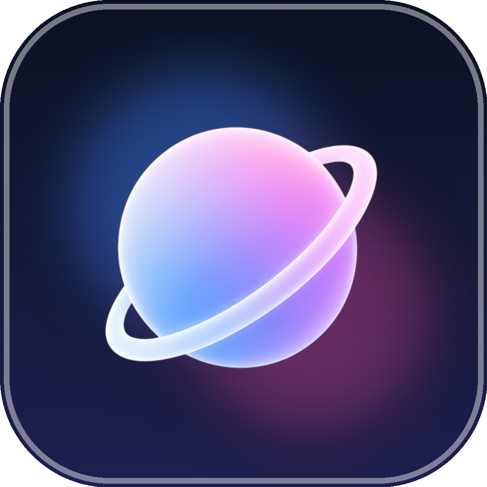

<div align="center">

  

  # 🪐 Orbit Browser

  **A Next-Generation, Glassmorphic Android Web Browser built with Jetpack Compose & Kotlin**

  [](https://kotlinlang.org/)
  [](https://developer.android.com/jetpack/compose)
  [](https://dagger.dev/hilt/)
  [](https://developer.android.com/)
  [](LICENSE)

  *Experience the web with fluid zero-reload tab switching, ambient wallpaper dynamic themes, built-in privacy protection, and a biometric password vault.*

</div>

---

## ✨ Features

### 🎨 **Dynamic Glassmorphic Theme Engine**
- **Frosted Glass Containers**: Blur effect with custom noise and HSL color tinting.
- **Ambient Color Extraction**: Extracts primary, secondary, and accent colors live from your wallpaper.
- **Adaptive Day & Night Modes**: Seamless transitions with live atmospheric icons based on time and local weather.

### ⚡ **Zero-Reload Tab Switcher**
- **Persistent DOM Lifecycle**: Switch between open tabs instantaneously with zero page reloads or loss of form state.
- **Fluid Gesture Control**: Swipe left or right on tab cards to dismiss them with dynamic scale, opacity, and horizontal translation animations.
- **Tab Grouping**: Organize open tabs into custom color-coded groups with custom names.

### 🛡️ **Built-in Privacy Shield & Security**
- **Ad & Tracker Blocker**: High-performance EasyList and EasyPrivacy blocker engine running directly inside the WebView layer.
- **Biometric Password Vault**: Encrypted credential storage utilizing AES-256 GCM encryption backed by Android KeyStore and Biometric Prompt authentication.
- **Smart Pop-Up & Intent Engine**: Intelligent URL interceptor for external app links (`intent://`, `mailto:`, `tel:`) and `target="_blank"` pop-up windows.

### 🚀 **Browser Tools & Enhancements**
- **Reader Mode**: Distraction-free content layout for articles.
- **Find in Page**: Real-time text search with match counts and highlight controls.
- **QR Code Modal**: Scan & share URLs instantaneously via generated QR codes.
- **Download Manager**: Background download service with pause, resume, and progress notifications.

---

## 🛠️ Tech Stack & Architecture

- **UI Framework**: [Jetpack Compose](https://developer.android.com/jetpack/compose) with Material 3 design tokens.
- **Architecture**: MVVM + Clean Architecture with uni-directional data flow (StateFlow / SharedFlow).
- **Dependency Injection**: [Hilt](https://dagger.dev/hilt/) for modular Android dependency resolution.
- **Database & Persistence**: [Room Database](https://developer.android.com/training/data-storage/room) for History, Bookmarks, and Encrypted Vault.
- **Networking & Async**: [OkHttp3](https://square.github.io/okhttp/), Kotlin Coroutines, and Flow streams.
- **Web Rendering Engine**: AndroidX WebKit with custom `OBWebView` extensions.

---

## 📂 Project Structure

```
Orbit-Browser/
├── app/
│   └── src/main/java/com/Orbit/browser/
│       ├── OBApplication.kt              # App Application class & Hilt initialization
│       ├── browser/
│       │   ├── autofill/                 # Password autofill bridge script & listener
│       │   ├── engine/                   # OBWebView engine & custom WebChromeClient
│       │   └── tabs/                     # TabManager & state management
│       ├── data/                         # Room DB, News Repository, Preferences
│       ├── di/                           # Dependency Injection AppModule
│       ├── downloads/                    # OBDownloadService foreground service
│       ├── security/                     # AdBlocker, DNS resolver, Biometric Vault
│       └── ui/                           # Jetpack Compose UI Screens & Components
│           ├── animations/               # OBMotion transitions & spring specs
│           ├── components/               # IslandNavBar, TabSwitcher, SearchBar
│           ├── glass/                    # Frosted glass modifiers & shaders
│           ├── screens/                  # HomeScreen, BrowserScreen, Settings
│           └── theme/                    # Dynamic OBTheme colors & HSL palette
└── build.gradle.kts                      # Root Gradle configuration
```

---

## 🚀 Getting Started

### Prerequisites
- **Android Studio**: Ladybug (2024.2.1+) or newer.
- **JDK**: Version 17+.
- **Android SDK**: Target API Level 35 (Android 15), minimum API Level 26 (Android 8.0).

### Building & Running

1. **Clone the repository**:
   ```bash
   git clone https://github.com/samirkhurshid/Orbit-Browser.git
   cd Orbit-Browser
   ```

2. **Build the Debug APK**:
   ```bash
   ./gradlew assembleDebug
   ```

3. **Install directly on a connected device / emulator**:
   ```bash
   ./gradlew installDebug
   ```

---

## 📄 License

This project is licensed under the MIT License - see the [LICENSE](LICENSE) file for details.

---

<div align="center">
  <sub>Built with ❤️ by Samir Khurshid</sub>
</div>
